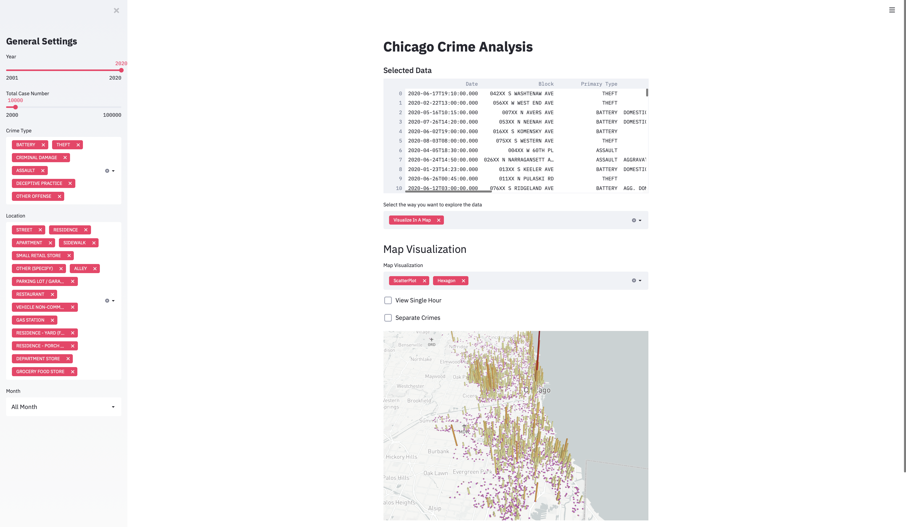

# Chicago Crime Analysis

In this project, we would like to explore the pattens of criminal actions happening in Chicago through visualization methods. The dataset we use here is the Chicago Crime Dataset, and this dataset contains information about the crimes happened in Chicago in the past 20 years. In specific, we will focus on the data in 2020.

## Project Goals

The general goal of our application is to explore the patterns of criminal actions happening in Chicago through visualization, statistic, and machine learning elements. In specific, we would like to explore the relationships between crime frequency, crime type, location, area in the city as well as times of the day. For example, in this application, we can discover when and where a specific kind of crime is most likely to happen, and what time of a day does each kind of crime happen most. From the aspect of an individual, our application might help to figure out the potentially dangerous area at different times of a day to reduce the chance of being harmed. Besides, we would like to explore the possibility to predictively figure out the type of crimes given other elements through machine learning methods.

## Design

In general, our application can be separated into 4 components, including 1) General Settings, 2) Map Visualization, 3) Chart Visualizations and 4) Machine Learning visualizations. The 4 components can exist on the same page, and interact with each other within a limit. 

In the general settings, the main purpose is to do some general filtering on the original dataset, to improve the visualization quality and filter uninformative records. It selects the year of records, total sample numbers, types of crime to consider, locations, and month that the crimes happen. Directly including all data records within a year into the analysis is also feasible, but not used here as it leads to bad visualization quality, e.g. too dense scatter points in the map. By default, we select several most common types of crimes and locations to analyze.

In map visualization, our goal is to visualize which region the crimes happen in. To do this, we by default use scatter points to locate the crimes on the map. The reason we choose the scatter point as the default method is for its good balance of detailed view and global view. By zooming in the camera, we can see in detail where the crime has happened while zooming out, we can read the 'dangerous area' in the city by examining the density of the points. Here we also support hourly views of the crime so that we can have more detail about the criminals. Besides scatter points, we also support heat maps and hexagon maps, which demonstrate the density of crimes more directly.

In the chart visualization part, its purpose is to interactively explore the relationships between crime location, crime type, geography locations, and time of the day that the crimes happen. Four charts (most common crime types, most common locations, hourly trends of crimes and a map) are unified here to allow interactivity with the users. We allow users to do selections and filtering in each graph based on the interests and the charts will be adjusted. Then the readers can read details about the cases in the map, where tooltips are used to provide information. This way we can answer the questions like where should we avoid going if we want to avoid robbery at midnight. In this section, we selected bar chart, area chart, and stacked bar chart and a map to express the data. We have also tried some other charts but it turns out that they express information poorly. 

In the machine learning part, our goal is to examine if we can separate different types of crimes based on other factors. To achieve this goal, we first preprocess the variables into numbers and performed dimension reduction in our data. Then we plot the compressed data in a 3-D space, where we could examine the separability of data. We include multiple algorithms in our design to allow a more comprehensive understanding of the properties of data.

## Development

In this project, Jingyuan Li is in charge of Map Visualization and Chart Visualization while Chuhan Feng is in charge of Machine Learning Visualization. We build a general framework for our application and we work on our parts separately during the development. In the end, we integrate all the code together. For the Map Visualization and Chart Visualization sections, it took 40-50 hours in total to develop our application. Most of the time spent is to find the best way to find appropriate expressions and make the charts easy-to-read. 